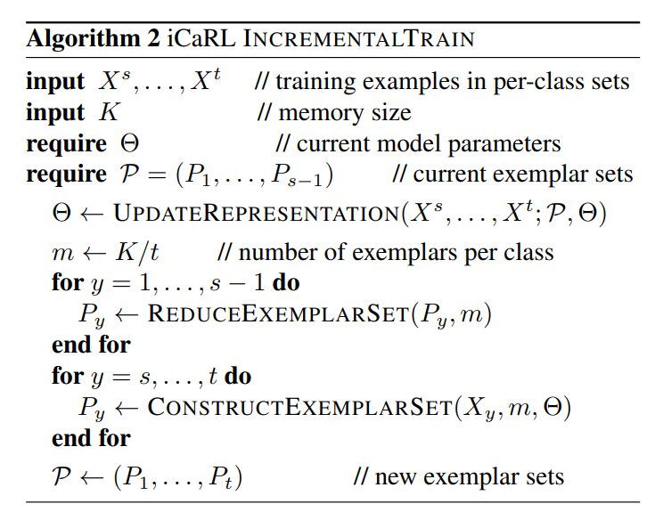
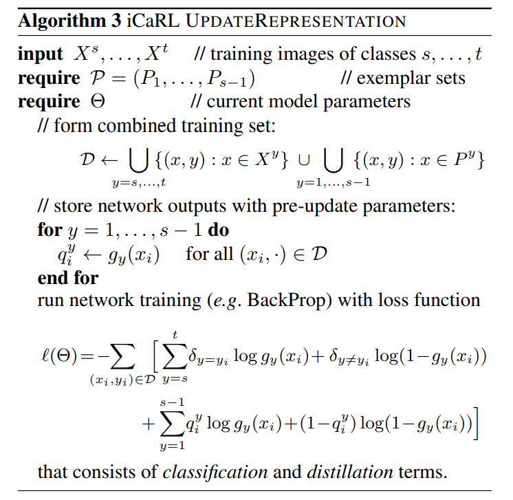
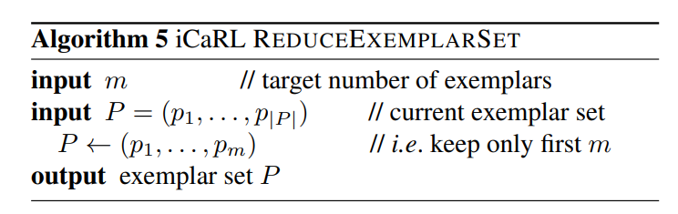
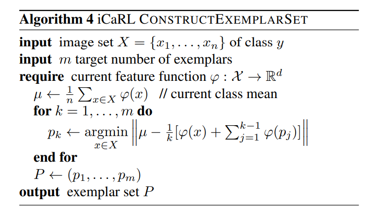
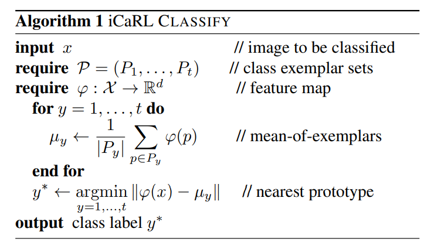
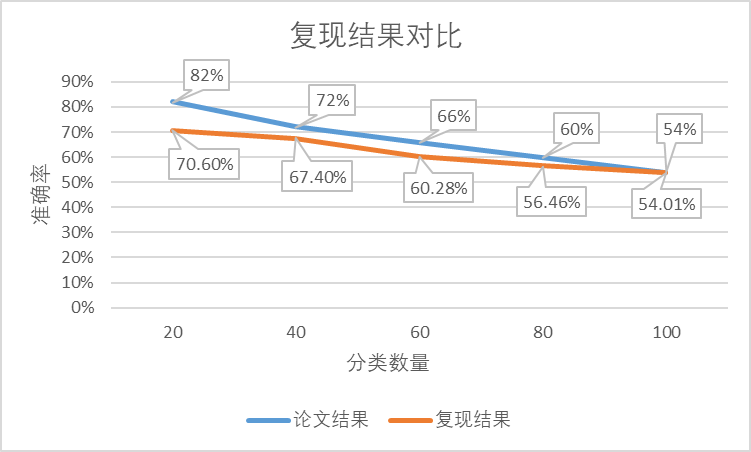

# iCaRL: Incremental Classifier and Representation Learning算法复现

### 小组成员

191830207 张刘洋

191830060 黄相淇

## 1. 算法整体思路

算法构造了一个神经网络分类器，且将分类器分成了特征提取部分和全连接层，我们可以单独使用特征提取部分获取图象的特征，也可以加入全连接层，使全连接层起一个分类器的作用，直接将输入图像进行分类。我们需要从训练数据中挑选出任务样本的prototype，在测试阶段根据测试样本和范例中心之间的特征距离来分类，其中挑选prototype和计算特征距离都要依赖于网络的特征提取功能。

在持续学习的过程中，我们需要将先前的prototype和新数据集混合输入到网络中进行训练，使得所有prototype中心都能根据更新后的模型进行调整。在分类过程中，我们需要使用神经网络提取数据特征值，之后将特征值与范例集合中每类范例中心比较，将其分为范例集合中的某类。

算法内容可简单分为两个大部分，分别为增量训练和分类，下面我将分开叙述两者的算法细节。

### 1.1 增量训练

增量训练的输入是一系列分类好的数据集，另外需要模型本身设置的一些参数，如内存大小（能存储prototype的总数）、神经网络参数、以及范例集合。

接下来执行三个具体算法，分别是表征学习、缩减范例集合、构建范例集合，总体如下

我们将范例集合和新数据集混合后输入到神经网络中进行训练并更新其参数，然后计算新的范例集合中每个种类的个数，并将现有的范例集合数量缩减到一定数目，最后从新数据集中选取一定数量的样本作为范例，重新构建新的范例集合。具体实现如下

#### 1.1.1 表征学习

表征学习实际上就是将新数据集和范例集合混合作为神经网络的输入，然后根据神经网络的输出和实际类别计算其相应的损失函数，然后根据损失函数对神经网络的权重进行调整。算法的关键在于不仅使用新的数据集进行训练，同时也要将范例集合混合进输入进行训练。

#### 1.1.2 缩减范例集合

由于内存有限，我们的范例集合能储存的样本数量是有限的，因此每当有新的类别增加时，我们需要降低每个类的范例数量，具体算法如下。

实际上算法比较简单，我们只需要保留前m个距离范例中心较近的样本即可。

#### 1.1.3 构建范例集合

由于有新的类别加入，我们需要将新的类别加入到范例集合中，具体算法如下。

算法的原理并不复杂，我们需要先用神经网络提取每个数据的特征值，并计算出每个类特征的均值，最后选择距离均值较近的数据加入到范例集合即可。

### 1.2 分类

分类的进行必须依赖神经网络的提取特征值功能和范例集合进行，算法如下。

我们需要利用神经网络提取数据的特征值，再计算范例集合中每个类的范例中心，将计算输入数据和各范例中心的距离，将其归为距离最近的类。

### 1.3 总结

训练过程我们需要构建一个神经网络和一个范例集合。和传统的神经网路分类不同，我们不用全输出层作为分类标准，仅使用提取特征值的功能来提取数据的特征值。使用数据特征值和范例中心的距离作为标准来进行分类。

## 2. 算法复现

### 2.1 数据预处理

首先框架已经完成了大部分的数据预处理过程，但是框架实现的有些部分不便操作，因此我做了部分修改，具体修改点如下

-   数据集中不存储图片的名字，改为直接存储PIL.Image类型，存放在`data`中

-   修改了`__getitem__(self, idx):`的实现，如下
    ~~~python
    def __getitem__(self, idx):
        sample = copy.copy(self.data[idx])
        sample["image"] = self.transform(sample["image"])
        return sample
    ~~~

另外，从阅读框架中可以发现，数据预处理时，将原本84*84的图片，随机裁剪成了32\*32的大小，因此每一个epoch得到的训练集和测试集实际上都是不一样的，这样有助于提升整个模型的泛化性，但同时为之后构建范例集合提升难度。

### 2.2 开始任务前

开始任务前需要调整全输出层的维度，重新设置权重，并且设置优化器等内容，这些代码框架都已经实现，直接复用即可。

### 2.3 训练

训练前需要先设置数据集，将新数据集和范例集合进行融合，我们实现了`combine_dataset_with_exemplars`方法帮助完成这一任务。

之后只需要按照原框架所示，在每个epoch从data_loader中获取数据（因为随机裁剪的关系，每次数据都不一样），并根据返回结果计算损失函数，调整权重。每一个epoch后利用全输出层进行评价，评价的方法基本还是复用原框架的实现。

实际上这个评价意义并不大，因为框架中的预测值是通过全输出层进行分类的，但算法并不使用全输出层作为分类标准。而使用范例集合进行分类无法在每一个epoch进行评价，因为新的范例集合必须在训练完成后才能生成，因此无法在训练过程中使用范例集合对结果进行实时评价，因此只能用框架中的全输出层输出的结果作为分类精度的参考。

### 2.4 结束任务

在结束任务后，我们就正式开始构建所需的范例集合。

#### 2.4.1 缩减范例集合

~~~python
def reduce_exemplar_sets(self, m):
    for key, value in self.exemplar_set.items():
        self.exemplar_set[key] = value[:m]
~~~

缩减范例集合的方法比较简单，只需要将每一个类的范例截取至相应长度即可。由于一开始加入列表时就是按顺序加入的，因此结果也是前m个距离最近的范例

#### 2.4.2 构造范例集合

~~~python
for y in range(cur_iter * 20, (cur_iter + 1) * 20):
	images = self.train_dataset.get_image_class(y)
	self.construct_exemplar_set(images, y, k)

def construct_exemplar_set(self, images, img_class, m):
    class_mean, feature_extractor_output = self.compute_class_mean(images)
    exemplar = []
    now_class_mean = np.zeros((1, 512))
    for i in range(m):
        # shape：batch_size*512
        x = class_mean - (now_class_mean + feature_extractor_output) / (i + 1)
        # shape：batch_size
        x = np.linalg.norm(x, axis=1)
        index = np.argmin(x)
        now_class_mean += feature_extractor_output[index]
        exemplar.append(images[index])
    self.exemplar_set[img_class] = exemplar
~~~

首先我们需要从数据集中选取某一类的所有数据，然后计算该类的特征值均值和所有特征值结果，之后计算特征值距离均值最近的数据加入到范例集合中即可

#### 2.4.3 计算范例均值

~~~python
def compute_exemplar_class_mean(self):
	self.exemplar_means = []
	for index in range(len(self.exemplar_set)):
		exemplar = self.exemplar_set[index]
		# exemplar=self.train_dataset.get_image_class(index)
		class_mean, _ = self.compute_class_mean(exemplar)
		class_mean_, _ = self.compute_class_mean(exemplar)
		class_mean = (class_mean / np.linalg.norm(class_mean) + class_mean_ / np.linalg.norm(class_mean_)) / 2
		self.exemplar_means.append(class_mean)
~~~

在构建完范例集合后，需要对范例中的每个类计算均值并保存，用于之后的分类。

#### 2.4.4 分类评价

编写分类算法如下

~~~python
def classify(self, x):
	result = []
	test = F.normalize(self.model.feature_extractor(x).detach()).cpu().numpy()
	# test = self.model.feature_extractor(test).detach().cpu().numpy()
	class_mean_set = np.array(self.exemplar_means)
    for target in test:
		x = target - class_mean_set
        x = np.linalg.norm(x, ord=2, axis=1)
        x = np.argmin(x)
        result.append(x)
    return torch.tensor(result)
~~~

算法实际上就是将输入数据使用神经网络提取特征值，然后和当前的范例均值进行比较，得到输入数据相应的类别即可。

编写评价方法如下：

~~~python
def cal_accuracy(self):
    correct, total = 0, 0
    test_loader = DataLoader(self.test_dataset, shuffle=False, batch_size=self.batch_size, num_workers=self.n_woker)
    with torch.no_grad():
        for i, data in enumerate(test_loader):
            x = data["image"].to(self.device)
            y = data["label"].to(self.device)
            preds = self.classify(x)
            correct += (preds.cpu() == y.cpu()).sum()
            total += len(y)
    logger.info(f"total accuracy:{(correct * 100 / total):.2f}%")
~~~

将测试数据传入`classify`方法获取预测值，并计算正确率即可。

**注意：这里计算出的准确率才是算法中的分类方法得到的有意义的准确率。前面使用全输出层的预测只有一定的参考意义**

## 3. 复现结果

由于我只测试了每次训练20类数据的情况，因此以该结果为例

从日志中可以看到，在20类、40类、60类、80类、100类的分类准确率分别为70.60%、67.40%、60.28%、56.46%、54.01%

论文中的数据约为82%、72%、66%、60%、54%，可以发现，刚开始的分类结果有一定差距，但之后的分类结果达到论文中的标准

**注：论文中每个epoch显示的准确率为使用全输出层进行预测的结果，复现的实际准确率应以`total accuracy`为准**

将论文结果和复现结果作图如下

## 4. 反思

复现结果和实际结果还是有一定的差距的，个人总结产生差距的原因如下

-   论文中使用的神经网络是32层的resnet，并且每次训练70epochs，而我本身使用的时18层的resnet，且只训练了30epochs（不换神经网络只提升训练的epoch数量没有意义，因为30epochs的训练集准确率都能道到达97%+）。因此换层数更多的resnet也许会有更好的结果。
-   我们使用的损失函数是CrosEntropyLoss而不是BCELoss，我们认为CrosEntropyLoss会有更好的结果
-   在学习率上，论文中开始的学习率是2.0，而我使用的是0.1（不是很明白为什么要2.0）
-   也许在算法实现上还有诸多细节不同
-   由于在提取图片特征时，是随机将图片裁剪成32*32的大小，这么做有助于提升神经网络的普适性，但这也意味着每个epoch的数据都是不同的，可能会导致后面训练的数据使得前面训练的数据无法通过的情况。最好的做法是每个epoch都将之前的数据一同加入训练集进行训练，但这样不仅会增加训练的时间和算力，且会增加未来构建范例集合的难度（可能多个距离范例中心较近的数据来源于同一张图片的多个部分），因此未采用该方案。
-   在构建范例集合时，由于裁剪图片的随机性，可能每次构建的范例集合都不相同，而范例集合对于之后结果的影响是非常大的，因此这个也是影响最终结果的一大原因。